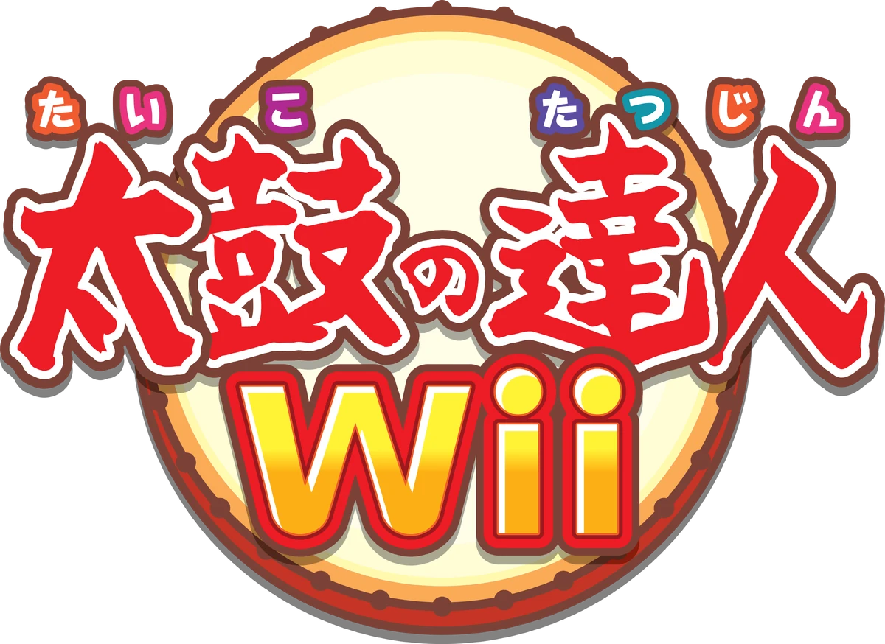

# Taiko-Patcher

One patcher for the five Taiko no Tatsujin Wii games (Japan).




| key | game | ID6 |
|---|---|---|
| taiko1 | Taiko no Tatsujin Wii | R2JJAF |
| taiko2 | Chou Goukaban | S5KJAF |
| taiko3 | Dodoon to 2-daime! | S2TJAF |
| taiko4 | Ketteiban | STJJAF |
| taiko5 | Minna de Party 3-daime! | S3TJAF |

## What it adds

* **GameCube controller** and **DK Bongos**, per player port. The pad shows up to the game as a
  connected TaTaCon, so menus and songs behave exactly like with the real drum.
* **Classic Controller**: all five games already support it natively (D-pad = left don, face buttons = right
  don, L/ZL = left ka, R/ZR = right ka). Game 1 lacked ZL/ZR, the patch adds them.
* Wii Remote: unchanged. Nunchuk: see *Status*.

### GameCube mapping

| Drum face | GameCube pad | DK Bongos |
|---|---|---|
| left don (center L) | B, Y, D-pad down, left stick down | left bongo |
| right don (center R) | A, X, D-pad up, left stick up | right bongo |
| left ka (rim L) | L, D-pad left, left stick left, C-stick left | clap (alternates sides) |
| right ka (rim R) | R, D-pad right, left stick right, C-stick right | clap (alternates sides) |
| pause / start (+) | Start | Start |
| cancel / back | Z | - |

In menus the rims are left/right and either don is "decide", just like the drum.

## Use

```sh
python3 -m taiko_patcher list
python3 -m taiko_patcher info  main.dol
python3 -m taiko_patcher patch main.dol              # -> main.patched.dol
python3 -m taiko_patcher patch "Game.d"              # extracted folder: patches sys/main.dol in place (+ .orig backup)
python3 -m taiko_patcher patch Game.wbfs             # disc image (needs wit): -> Game.patched.wbfs
```

### GUI

```sh
python3 -m taiko_patcher.gui          # drop a .wbfs/.iso (or main.dol) on the window
tools/build_gui.sh                    # standalone app via PyInstaller -> tools/dist/Taiko-Patcher(.app)
```
Disc images are replaced in place and the original is kept as `<name>.bak`, like ACCF-Patcher. Drag-and-drop needs
`pip install tkinterdnd2` (otherwise click to browse). The app icon is made from `assets/logo.png` by `tools/make_icon.py`.

### Gecko codes and Riivolution

No patching needed: `codes/<ID6>.ini` (Dolphin) / `.txt` (any Gecko loader) and `riivolution/<ID6>.xml` apply the same
patch at runtime. They are generated from the same plan as the DOL patch (`python3 tools/gen_codes.py`, checked in CI).
Don't combine them with a DOL that is already patched.

Options: `--no-gc`, `--no-classic`, `--no-stick`, `--no-clap`, `--game taikoN`.
Only Python 3.9+ (stdlib) is needed to run it; [wit](https://wit.wiimm.de/) only for disc images.
A modified disc needs a way to run unsigned/altered discs (Dolphin, a softmodded Wii with a USB loader).

## How it works

A 1.3 KB payload (`payload/taiko_pad.c`, built with devkitPPC) is added to the DOL as a new text section at
`0x80003200`. The game already calls `PADInit`, so the SI hardware poller is running; the payload reads the SI
input registers directly. Per game, the patcher hooks:

1. the `bl WPADProbe` in the per-frame poll: polls the GC port of that channel and, if a pad answers,
   reports the port as a connected TaTaCon (type `0x13`);
2. the game's own button-state code (`family A`, game 1: two leaf hold makers; `family B`, games 2-5: the shared
   `CPadCommon::update`) to OR the drum / start / cancel bits into the same state arrays the real TaTaCon and
   Wii Remote feed.

Because the game itself decides what the bits mean, menus, songs, pause and multiplayer work unchanged.
All addresses are verified against the original instruction words before anything is written. Details of the
reverse engineering are in `docs/`.

Rebuild the payload: `payload/build.sh` then copy `payload.bin`/`payload.sym` to `taiko_patcher/data/`.

## Status

Verified in Dolphin (virtual GC pad, reading the game's own input state): **game 1 completely**; games 2 and 3
detect the pad and present it as a TaTaCon. The shared hook used by games 2-5 is byte-identical in all four
games but has not been exercised with input yet. Nothing was tested on real hardware or with real DK Bongos.
Details in `docs/TESTING.md`. Nunchuk gameplay support is not implemented (no game uses the Nunchuk for hits).
